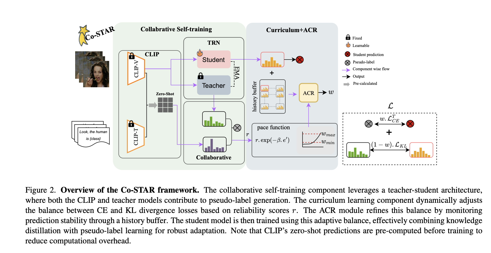

# Co-Star: Collaborative Curriculum Self-Training with Adaptive Regularization for Source-Free Video Domain Adaptation
<figure>
  
  <figcaption>
    <strong>Overview of the Co-STAR framework.</strong> The collaborative self-training component leverages a teacher-student architecture, where both the CLIP and teacher models contribute to pseudo-label generation. The curriculum learning component dynamically adjusts the balance between CE and KL divergence losses based on reliability scores r. The ACR module refines this balance by monitoring prediction stability through a history buffer. The student model is then trained using this adaptive balance, effectively combining knowledge distillation with pseudo-label learning for robust adaptation. Note that CLIP's zero-shot predictions are pre-computed before training to reduce computational overhead.
  </figcaption>
</figure>

## Training
Please refer to the sample bash script located in the src directory to start training. Further details will be added soon.
