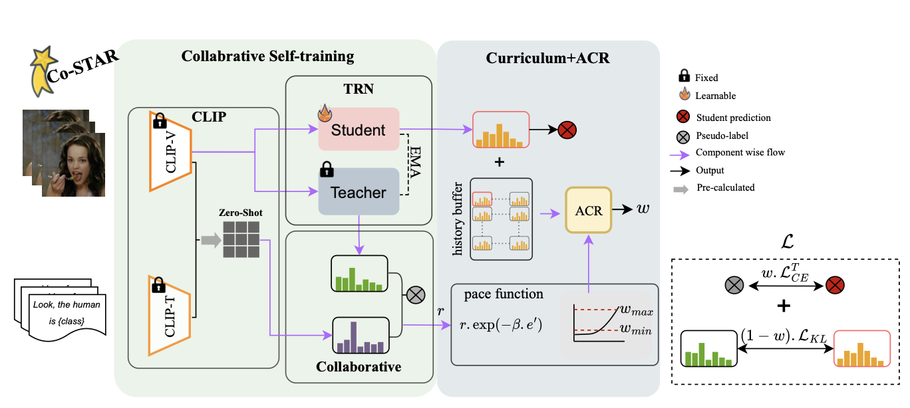

# Co-STAR: Collaborative Curriculum Self-Training with Adaptive Regularization for  
Source-Free Video Domain Adaptation (WACV 2026)

**Co-STAR** is a source-free video domain adaptation framework that addresses
**noisy and overconfident pseudo-labels** by combining collaborative self-training
(teacher + CLIP), reliability-based curriculum learning, and adaptive regularization.
Without access to source data, Co-STAR achieves **state-of-the-art performance**
across multiple SFUVDA benchmarks.

---

## Problem Setting

In **Source-Free Unsupervised Video Domain Adaptation (SFUVDA)**, a model trained
on a labeled source domain must adapt to an unlabeled target domain **without
access to the source data**, due to privacy or legal constraints.

Key challenges include:
- severe domain shift in video data
- noisy pseudo-labels during self-training
- overconfident but incorrect predictions that reinforce early errors

---

## Method Overview

<figure>
  
  <figcaption>
    <strong>Overview of the Co-STAR framework.</strong>
    Co-STAR combines collaborative self-training with curriculum learning and
    adaptive regularization. Pseudo-labels are generated jointly by a source-trained
    teacher and CLIP. A reliability-based curriculum dynamically balances cross-entropy
    and KL-divergence losses. Adaptive Curriculum Regularization (ACR) monitors
    prediction stability over time to mitigate overconfident and noisy pseudo-labels.
    CLIP zero-shot predictions are pre-computed to reduce computational overhead.
  </figcaption>
</figure>

### Core Components

1. **Collaborative Self-Training**
   - Pseudo-labels are generated jointly by a frozen source-trained teacher
     and a domain-agnostic vision–language model (CLIP).
   - A confidence-aware selection strategy integrates both predictions.

2. **Reliability-Based Curriculum Learning**
   - Sample reliability is estimated via bidirectional KL divergence
     between teacher and CLIP predictions.
   - Training progresses from reliable to more challenging samples.

3. **Adaptive Curriculum Regularization (ACR)**
   - Detects overconfident yet unstable predictions using a temporal
     history buffer.
   - Probabilistically adjusts sample weights to prevent confirmation bias
     and improve training stability.

---

## When Should You Use Co-STAR?

**Use Co-STAR if:**
- source data is unavailable
- domain shift is large (e.g. illumination, viewpoint, capture conditions)
- pseudo-label noise is a major concern
- you want to leverage CLIP without fully trusting its predictions

**Limitations:**
- performance depends on CLIP zero-shot quality
- not designed for real-time or online adaptation

---

## Environment Setup

The `co-star.yaml` file can be used to create the conda environment with all
dependencies required to train Co-STAR:

```bash
conda env create -f co-star.yaml
conda activate co-star
```


# Training

Please refer to the sample bash script (`run.sh`) located in the `src` directory to start training.

### Configuration Setup

Before training, you need to configure the data paths:

1. **Update data paths**: Edit `configs/experiment/arid_mit.yaml` and change the paths to your local data directory.

2. **For new experiments**: You can create additional `.yaml` files in the `configs/experiment/` directory for your custom experiments. However, make sure to update the experiment name in `configs/train.yaml` accordingly, as it is currently set to `arid_mit`.

### Quick Start

```bash
# Navigate to src directory
cd src

# Run training script
./run.sh
